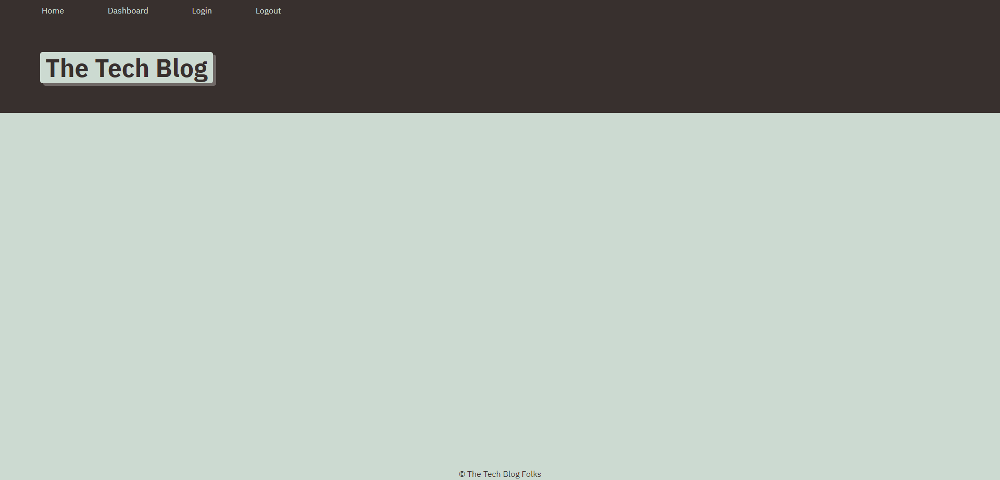

# Tech-Blog

## Description

A Tech Blog project created with MVC design, with mysql as its database to handle new posts and users.

## Installation

After downloading the repository, run `npm install` to download dependencies.

## Usage

When after logging in or creating a new account, the user can create a new post with a title and description. After which the post can be edited by the owner, and can be commented on by other users.

## Credits

CSS stylng and view layout are pulled from course challenge materials

## License

N/A
---